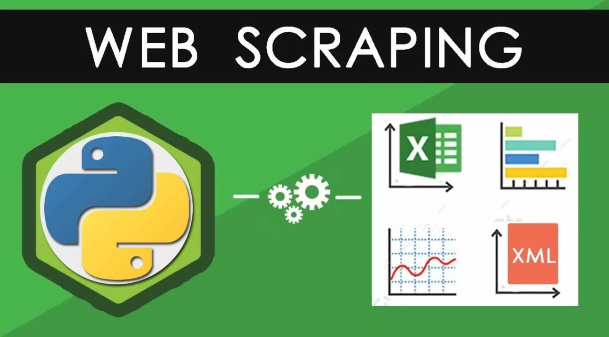

# Python-Web-Scraping-Extracting-Data-from-Real-Estate-Websites

Python, Web Scraping, Real Estate, Websites, Data Extraction, BeautifulSoup, Scrapy, Property Details, Prices, Location Data.

Python is a powerful programming language that has become increasingly popular in recent years. One of the many use cases for Python is web scraping, which involves extracting data from websites. In this article, we will discuss the basics of web scraping using Python and some of the libraries that make it easy.

Before we dive in, it's important to note that web scraping can be a gray area, legally speaking. While there are many legitimate use cases for web scraping, some websites prohibit scraping in their terms of service. Additionally, some websites may have measures in place to prevent scraping. As a responsible developer, it's important to ensure that you have permission to scrape a website and that you're not causing any harm.

With that said, let's get started with web scraping in Python. The first thing you'll need to do is install the necessary libraries. The most popular libraries for web scraping in Python are Beautiful Soup and Scrapy.

Beautiful Soup is a library that makes it easy to parse HTML and XML documents. It's designed to be easy to use and doesn't require much code to get started. Scrapy is a more advanced library that is designed specifically for web scraping. It provides a framework for building web spiders, which are programs that crawl websites and extract data.

Once you have your library installed, the next step is to identify the website you want to scrape and the data you want to extract. This will typically involve inspecting the website's HTML or XML structure to determine where the data is located.

Python Web Scraping is a powerful technique for extracting data from websites, and it has become increasingly popular in recent years. This technique can be applied to various domains, and one of the most popular ones is real estate. In this article, we will explore how to extract data from real estate websites using Python web scraping. We will discuss the basics of web scraping, how to identify the data you want to extract, and how to use libraries such as BeautifulSoup and Scrapy to automate the process. By the end of this article, you will have a better understanding of how Python web scraping can be used to extract valuable data from real estate websites, such as property details, prices, and location data.

